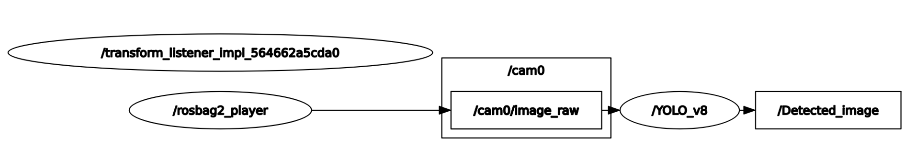

# YOLOv8_ONNX_ROS2


This repository is a ROS2 package that performs object detection using YOLOv8 with ONNX.


## ROS Package Configuration
**Subscribed Topic**: 
  - Image-stream : ```sensor_msgs/msg/Image```<br>

**Published Topic**: 
  - Image-stream with bounding box around detected objects : ```sensor_msgs/msg/Image```<br>
 


## Installation
You can easily convert using the ultralytics python library.
```shell
pip install ultralytics
```

Please write down a Python file to convert a PyTorch model to ONNX format. 
```python
from ultralytics import YOLO

model_name = 'yolov8m' #@param ["yolov8n", "yolov8s", "yolov8m", "yolov8l", "yolov8x"]
input_width = 640 #@param {type:"slider", min:32, max:4096, step:32}
input_height = 480 #@param {type:"slider", min:32, max:4096, step:32}
optimize_cpu = False

model = YOLO(f"{model_name}.pt") 
model.export(format="onnx", imgsz=[input_height,input_width], optimize=optimize_cpu)
```

## Usage

```shell
ros2 launch yolo_v8 detection.xml
```


## Results
* Actual video
TBD
* comparison table
TBD

## Experimental Setup
platform and experiment situation
we experimented with the MicroRos-Rp5 model at UNIST.

## References

* [https://github.com/ConfusionTechnologies/ros-yolov5-node](https://github.com/ibaiGorordo/ONNX-YOLOv8-Object-Detection)
* [https://github.com/ultralytics/ultralytics](https://github.com/ultralytics/ultralytics)
  
## Developers
* Minje Kim (minje617@gmail.com)
